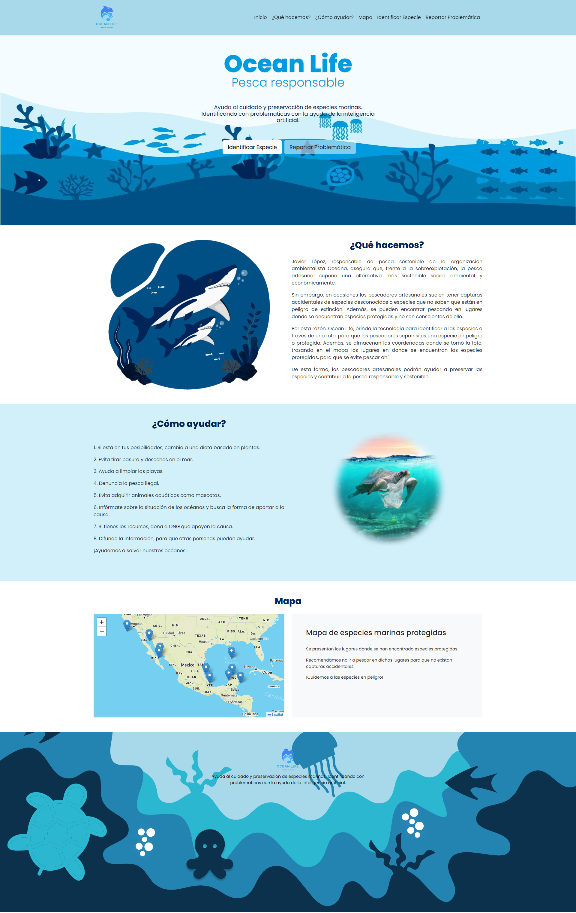

## ¿Quiénes somos?

OCEAN LIFE es una organización encargada de procesar los datos del océano. Entre nuestras capacidades está la interacción del usuario y la de un dispositivo con detección. Con estas interacciones, podemos procesar los datos obtenidos para planear, indicar o reaccionar según sea la ocasión. Con esto es posible recibir reportes de varios tipos como pueden ser: grandes contaminaciones como el plástico, denuncias de pesca ilegal, detección temprana de especies invasoras, reportes de problemas ambientales, monitoreo para reproducción de especies en peligro de extinción, reportes de sargazos y un control de la sobrepesca.

## Pescando con responsabilidad.

A veces, las personas que pescan como hobby o que quieren iniciarse en este pacífico pasatiempo, estos no son conscientes del lugar donde están pescando. Y en más de una ocasión se han encontrado especies de peces u otros animales marinos en lugares donde no deberían estar. Con suerte esto puede quedar como una anécdota para contar en las futuras reuniones con amigos, conocidos o familiares, pero; si la criatura pertenece a una a una especie en amenazada o en peligro podría causar un enorme daño a los intentos de la preservación de dichas especies. 

En otra instancia muchas de las especies invasoras no son detectadas a tiempo por las instituciones encargadas de su expulsión en la zona, con la ayuda de las personas que practican la pesca se podrían detectar a tiempo y con ello preservar no solo a las especies en peligro, sino también a las especies locales.

Pero no solo las especies invasoras pueden afectar de manera negativa al medio ambiente, sabemos que uno de los más grandes problemas que el ecosistema tiene es nuestra inconsciencia como personas, así es como existen lugares llenos de basura generada por envolturas, fabricas que arrojan desperdicios en los ríos, manejo erróneo de alcantarillas y drenaje público, etc.

Es por ello que con inteligencia artificial, uso de localización nos encontramos desarrollando Ocean Life, una aplicación web que de manera rápida permite reportar avistamientos de especies invasoras o protegidas en lugares donde no es común su presencia. Además, permitirá reportar usos indebidos de ríos, lagos, arroyos, etc; por parte de comunidades o empresas.

## Resolución a problemáticas

* Detección de contaminación 
* Reporte del uso de pesca de arrastre y pesca ilegal
* El monitoreo de especies en peligro para mejorar su reproducción
* Detección temprana de especies invasoras para su extracción
* Detección problemas ambientales
* Detección sargazo
* Reportes de empresas contaminantes
* Control de la sobrepesca

## Importancia de las problemáticas

* La contaminación supone un peligro para la salud humana de consumirse pescados y mariscos contaminados. 
* La pesca ilegal, no declarada y no reglamentada amenaza el manejo sostenible de los recursos marinos, poniendo en riesgo la vida de los ecosistemas y el sustento de los pescadores y sus comunidades en países en desarrollo.
* La pérdida de cualquier especie puede generar cambios negativos en los ecosistemas.
* Cuando el sargazo muere y se descompone, consume grandes cantidades de oxígeno causando anoxia, lo cual matará a otras especies.
* Capturar demasiados peces puede romper abruptamente la cadena alimenticia y tener múltiples efectos.

## ¿Cómo resolvemos estas problemáticas?

Las problemáticos son grandes, por ello se enfrentará por dos medios. El del usuario con el uso del celular y el de un dispositivo que reconoce por medio de inteligencia artificial. 

Empezando por la sobrepesca, las especies en extinción y las especies invasoras.  El usuario, por medio de una web app, tendrá la posibilidad de verificar que animal es el que está pescando, y con esto podra ver las regulaciones de dicho pez. La aplicación le regresara las indicaciones a seguir, ya sea regresarlo, o poder conservarlo, ya sea que es una especie invasora, o porque es legal su pesca. Con la información que el usuario introducirá, será posible analizarla y tener el monitoreo para su correcta conservación, o por lo contrario buscar su extracción al ser especie invasora. Esto también se realizará por el medio estático de un dispositivo de reconocimiento en lugares claves.

La contaminación, sargazo, problemas ambientales y empresas contaminantes se podrán combatir con los reportes que también se realizarán en la app. Esto con el anonimato total. Al hacer reportes como este, o el del pescado. Se recibirán en la base de datos. Después de esto se visualizará en un mapa con su ubicación y detalles. Con el fin dar solución con la ayuda de otras organizaciones y el gobierno.

> El usuario y dispositivo de reconocimiento mandan datos a la inteligencia artificial, esta regresa una solución. Después el reporte llega a la base de datos. El layout manda el requerimiento a la base de datos para mostrar la petición del usuario.

### ¿Cómo se usarán los datos?

* Con los datos se podran analizar sus nuevas apariciones de especies para poder entender en que lugar es mejor su reproducción. 
* Se podra analizar la ruta de los contaminantes y donde se acumulan.
* Se analizaron las los desechos que tiran las empresas para su sanción.
* Se denunciara la pesca ilegal y se analizará la pesca y la frecuencia de especies para determinar si hay variantes que indiquen pesca ilegal.
* Se recibirán datos de las especies invasoras para capturarlas, ya que en el mar es difícil cerrar un área. Por lo cual es mejor prevenir las especies invasoras.
* Se recibirán problemas ambientales.
* Se reportara sargazo para su rápida eliminación.
* Se hará seguimiento de los peces para evitar una sobre pesca.

## Usó de nuestra web

### Primera opción, identificación del pez

* Entras a identificar especie

* Subes la foto

* Recibes la respuesta

### Segunda opción, reporte de problemática

## Tecnologías usadas

* HTML - Estructurar y desplegar una página web
* CSS - Especifica cómo se presentan los documentos a los usuarios
* JavaScript -  Lenguaje de programación que debes usar para añadir características interactivas a tu sitio web
* Bootstrap -  Biblioteca de código abierto para diseño de sitios y aplicaciones web
* Azure custom visión - Es un servicio de reconocimiento de imágenes que le permite crear, implementar y mejorar sus propios modelos de identificadores de imágenes.
* Node - Node.js es un entorno en tiempo de ejecución multiplataforma, de código abierto, para la capa del servidor
* Express - Entorno de trabajo para aplicaciones web para el programario Node.js

